# GitHub Actions Workflows

This directory contains comprehensive GitHub Actions workflows for the Shyvr RLTE (Reinforcement Learning Trading Engine) project. These workflows provide automated CI/CD, security scanning, dependency management, and deployment automation specifically optimized for ML/RL workloads.

## Workflow Overview

### Core CI/CD Workflows

#### 1. `ci.yml` - Main CI Pipeline
**Triggers:** Push to main/develop, PRs, manual dispatch  
**Duration:** ~15-30 minutes  
**Purpose:** Comprehensive CI pipeline with testing, quality checks, and deployment validation

**Key Features:**
- Dynamic test matrix based on change scope
- ML/RL model validation
- Docker build with security scanning
- Deployment readiness validation
- Extensive caching for Python dependencies
- Integration with existing Cloud Build pipeline

**Jobs:**
- Setup and configuration
- Code quality & security checks (Black, isort, Ruff, MyPy, Trivy)
- Testing matrix (unit, integration, performance)
- ML/RL model validation
- Docker build and security scan
- Deployment validation
- Notification and reporting

#### 2. `pr-validation.yml` - Pull Request Validation
**Triggers:** PR events (opened, synchronized, ready_for_review)  
**Duration:** ~10-25 minutes  
**Purpose:** Fast feedback for pull requests with intelligent test selection

**Key Features:**
- Quick validation for draft PRs
- Intelligent test selection based on changed files
- Performance impact analysis for ML/RL changes
- API change detection
- Security scanning for code changes
- Comprehensive PR status reporting

#### 3. `deploy.yml` - Deployment Automation
**Triggers:** Push to main/develop, tags, manual dispatch  
**Duration:** ~20-40 minutes  
**Purpose:** Automated deployment to staging and production with Cloud Run integration

**Key Features:**
- Environment-specific deployments (staging/production)
- Pre-deployment validation
- Cloud Run integration with proper scaling configuration
- Post-deployment smoke tests
- Telegram webhook updates
- Deployment monitoring setup

### Security & Quality Workflows

#### 4. `security.yml` - Comprehensive Security Scanning
**Triggers:** Push, PR, schedule (daily), manual dispatch  
**Duration:** ~15-25 minutes  
**Purpose:** Multi-layered security analysis and vulnerability detection

**Security Tools:**
- **SAST:** Bandit, Semgrep
- **Dependencies:** Safety, pip-audit
- **Containers:** Trivy, Grype
- **Secrets:** TruffleHog, GitLeaks
- **IaC:** Checkov, Trivy config scan
- **Compliance:** License scanning, policy checks

#### 5. `codeql.yml` - GitHub CodeQL Analysis
**Triggers:** Push, PR, schedule (weekly), manual dispatch  
**Duration:** ~10-20 minutes  
**Purpose:** Advanced semantic code analysis for security vulnerabilities

### Dependency & Performance Workflows

#### 6. `dependency-management.yml` - Automated Dependency Updates
**Triggers:** Schedule (weekly), manual dispatch  
**Duration:** ~20-35 minutes  
**Purpose:** Automated dependency updates with security prioritization

**Features:**
- Security update prioritization
- Comprehensive dependency auditing
- Automated PR creation for updates
- License compliance checking
- Dependency health analysis
- Integration testing for updates

#### 7. `performance-monitoring.yml` - Performance & Regression Detection
**Triggers:** Push, PR, schedule (daily), manual dispatch  
**Duration:** ~25-40 minutes  
**Purpose:** Continuous performance monitoring and regression detection

**Capabilities:**
- Performance baseline establishment
- Regression detection with historical comparison
- Memory usage profiling
- API performance benchmarking
- Automated performance reporting
- Performance trend analysis

### ML/RL Specific Workflows

#### 8. `ml-rl-validation.yml` - ML/RL Model Validation
**Triggers:** Changes to ML/RL code, schedule (daily), manual dispatch  
**Duration:** ~15-30 minutes  
**Purpose:** Specialized validation for machine learning and reinforcement learning components

**Validation Areas:**
- Model structure and integrity
- Training performance benchmarks
- Memory usage profiling
- Model regression testing
- Performance impact analysis
- Comprehensive validation reporting

### Documentation & Release Workflows

#### 9. `documentation.yml` - Documentation & Release Management
**Triggers:** Doc changes, tags, releases, manual dispatch  
**Duration:** ~10-20 minutes  
**Purpose:** Automated documentation generation and release management

**Features:**
- Markdown validation and link checking
- API documentation generation
- Release notes automation
- Documentation site building (MkDocs)
- GitHub Pages deployment
- Documentation completeness analysis

## Workflow Architecture

```mermaid
graph TB
    A[Code Push/PR] --> B{Event Type}
    
    B -->|Push to main/develop| C[CI Pipeline]
    B -->|Pull Request| D[PR Validation]
    B -->|Tag/Release| E[Deploy Pipeline]
    B -->|Schedule| F[Security Scan]
    B -->|Schedule| G[Dependency Updates]
    B -->|Schedule| H[Performance Monitoring]
    
    C --> C1[Code Quality]
    C --> C2[Testing Matrix]
    C --> C3[ML/RL Validation]
    C --> C4[Docker Build]
    C --> C5[Deploy Validation]
    
    D --> D1[Quick Checks]
    D --> D2[Targeted Tests]
    D --> D3[Security Check]
    D --> D4[API Changes]
    
    E --> E1[Pre-deploy Tests]
    E --> E2[Build & Push]
    E --> E3[Staging Deploy]
    E --> E4[Production Deploy]
    E --> E5[Post-deploy Monitor]
    
    F --> F1[SAST Scan]
    F --> F2[Dependency Scan]
    F --> F3[Container Scan]
    F --> F4[Secrets Scan]
    
    G --> G1[Security Updates]
    G --> G2[Regular Updates]
    G --> G3[Analysis & Reports]
    
    H --> H1[Baseline Tests]
    H --> H2[Regression Detection]
    H --> H3[Performance Reports]
```



## Configuration and Secrets

### Required Secrets

| Secret | Purpose | Used By |
|--------|---------|---------|
| `GCP_SA_KEY` | Google Cloud authentication | Deploy workflows |
| `GITHUB_TOKEN` | GitHub API access | All workflows (auto-provided) |
| `TELEGRAM_TOKEN` | Telegram bot updates | Deploy workflow |
| `CODECOV_TOKEN` | Code coverage reporting | CI workflow |

### Environment Variables

| Variable | Value | Purpose |
|----------|-------|---------|
| `PYTHON_VERSION` | `3.12` | Python runtime version |
| `PROJECT_ID` | `shvyr-ai-bots` | GCP project ID |
| `REGISTRY` | `us-central1-docker.pkg.dev` | Container registry |
| `REPOSITORY` | `shyvr-ai-prod` | Artifact repository |
| `IMAGE_NAME` | `shyvr-rlte` | Docker image name |
| `REGION` | `us-central1` | GCP region |

## Workflow Features

### Intelligent Caching
- **Python Dependencies:** uv cache with dependency hash keys
- **Docker Layers:** Multi-stage build cache with GitHub Actions cache
- **Analysis Results:** MyPy, Ruff cache for faster subsequent runs
- **Test Results:** Performance baseline caching for regression detection

### Parallel Execution
- **Test Matrix:** Unit, integration, and performance tests run in parallel
- **Security Scanning:** Multiple security tools run concurrently
- **Multi-environment:** Staging and production deployments can run in parallel

### Error Handling & Resilience
- **Graceful Failures:** Non-critical tests marked as warnings rather than failures
- **Retry Logic:** Network-dependent operations include retry mechanisms
- **Timeout Management:** All jobs have appropriate timeout settings
- **Artifact Preservation:** Test results and reports preserved even on failure

### Notification & Reporting
- **PR Comments:** Automated status updates on pull requests
- **GitHub Summaries:** Rich workflow summaries with key metrics
- **Issue Creation:** Automated issue creation for critical security findings
- **Artifact Management:** Comprehensive artifact collection and retention

## ML/RL Optimizations

### Memory Management
- **CPU-Only PyTorch:** Reduces memory usage in CI environment
- **Thread Limiting:** Controls OpenMP threads to prevent resource exhaustion
- **Memory Profiling:** Tracks memory usage across ML/RL components
- **Garbage Collection:** Explicit cleanup in memory-intensive operations

### Model Validation
- **Structure Validation:** Ensures model architectures are correct
- **Performance Benchmarking:** Validates training and inference performance
- **Regression Detection:** Compares model performance across versions
- **Integration Testing:** Tests ML/RL components with real data flows

### Performance Optimization
- **Benchmark Caching:** Stores performance baselines for comparison
- **Regression Thresholds:** Configurable performance regression limits
- **Memory Profiling:** Tracks memory usage patterns
- **Performance Reporting:** Detailed performance analysis and trends

## Integration with Existing Infrastructure

### Cloud Build Compatibility
- **Complementary Design:** GitHub Actions complement rather than replace Cloud Build
- **Shared Artifacts:** Docker images built in GitHub Actions used by Cloud Build
- **Environment Parity:** Same testing environment and dependencies
- **Secret Management:** Consistent secret management across platforms

### Google Cloud Integration
- **Cloud Run Deployment:** Direct integration with existing Cloud Run services
- **Secret Manager:** Uses existing secret management infrastructure
- **Cloud SQL:** Connects to existing database instances for testing
- **Monitoring:** Integrates with existing Prometheus/Grafana setup

### Database Integration
- **PostgreSQL Services:** Uses containerized PostgreSQL for testing
- **Migration Testing:** Validates database migrations in CI
- **Schema Validation:** Ensures database schema consistency
- **Performance Testing:** Database performance benchmarks

## Usage Examples

### Manual Workflow Dispatch

#### Run Security Scan
```bash
gh workflow run security.yml -f scan_type=full
```

#### Deploy to Staging
```bash
gh workflow run deploy.yml -f environment=staging
```

#### Performance Analysis
```bash
gh workflow run performance-monitoring.yml -f monitoring_type=regression-only
```

#### Generate Documentation
```bash
gh workflow run documentation.yml -f action_type=build
```

### Monitoring Workflow Status

#### Check Recent Runs
```bash
gh run list --workflow=ci.yml --limit=10
```

#### View Workflow Logs
```bash
gh run view <run-id> --log
```

#### Download Artifacts
```bash
gh run download <run-id>
```

## Best Practices

### Development Workflow
1. **Feature Development:** Create feature branch from develop
2. **PR Creation:** Automated PR validation runs
3. **Code Review:** Review automated feedback and test results
4. **Merge to Develop:** Triggers staging deployment
5. **Merge to Main:** Triggers production deployment

### Security Practices
- **Dependency Updates:** Weekly automated security updates
- **Vulnerability Scanning:** Daily security scans on main branch
- **Secret Management:** All sensitive data in GitHub Secrets or GCP Secret Manager
- **Compliance Monitoring:** Automated compliance checking and reporting

### Performance Monitoring
- **Baseline Establishment:** Performance baselines updated on main branch
- **Regression Detection:** Automated alerts for performance regressions
- **Trend Analysis:** Long-term performance trend monitoring
- **Resource Optimization:** Regular analysis of resource usage patterns

## Troubleshooting

### Common Issues

#### Workflow Failures
- Check job logs for specific error messages
- Verify all required secrets are configured
- Ensure dependency cache is not corrupted
- Check for rate limiting from external services

#### Deployment Issues
- Verify GCP service account permissions
- Check Cloud Run service configuration
- Validate secret manager access
- Ensure Docker image build succeeded

#### Performance Regressions
- Review performance benchmark reports
- Check for changes in test data or environment
- Validate baseline measurements are current
- Consider threshold adjustments for acceptable variance

#### Security Alerts
- Review security scan reports in GitHub Security tab
- Check for new vulnerabilities in dependencies
- Validate security configuration changes
- Update security policies as needed

### Getting Help

1. **GitHub Issues:** Create an issue with the `ci-cd` label
2. **Workflow Logs:** Check detailed logs in Actions tab
3. **Artifact Analysis:** Download and review workflow artifacts
4. **Documentation:** Refer to workflow-specific documentation

## Maintenance

### Regular Tasks
- **Monthly:** Review and update dependency versions
- **Quarterly:** Analyze workflow performance and optimization opportunities
- **Bi-annually:** Review security scanning configuration and policies
- **Annually:** Comprehensive workflow architecture review

### Updates and Improvements
- **Action Versions:** Keep GitHub Actions updated to latest versions
- **Tool Versions:** Update security scanning and analysis tools
- **Performance Tuning:** Optimize workflow execution times
- **Feature Enhancement:** Add new capabilities as project evolves