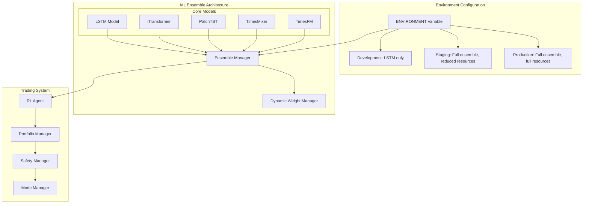
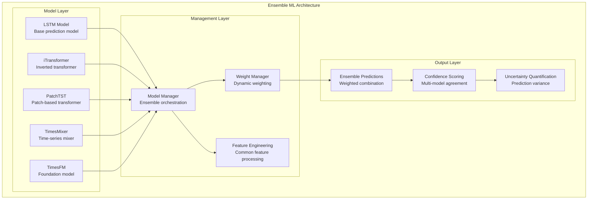
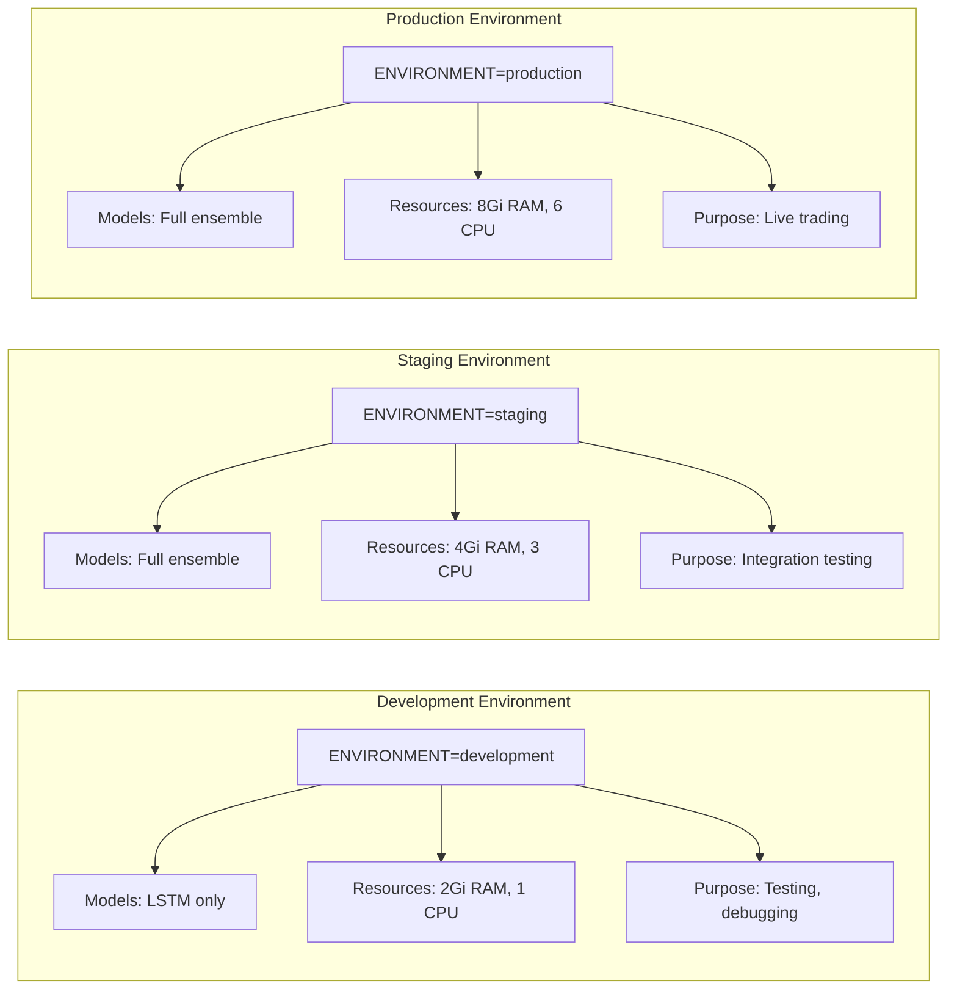
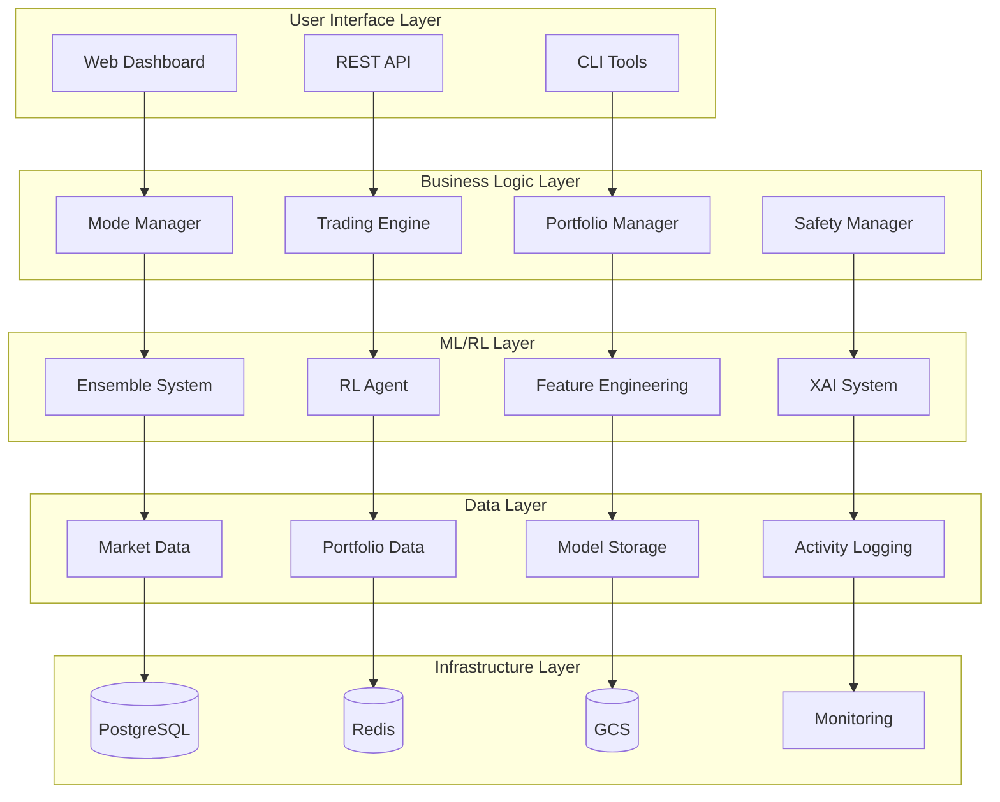
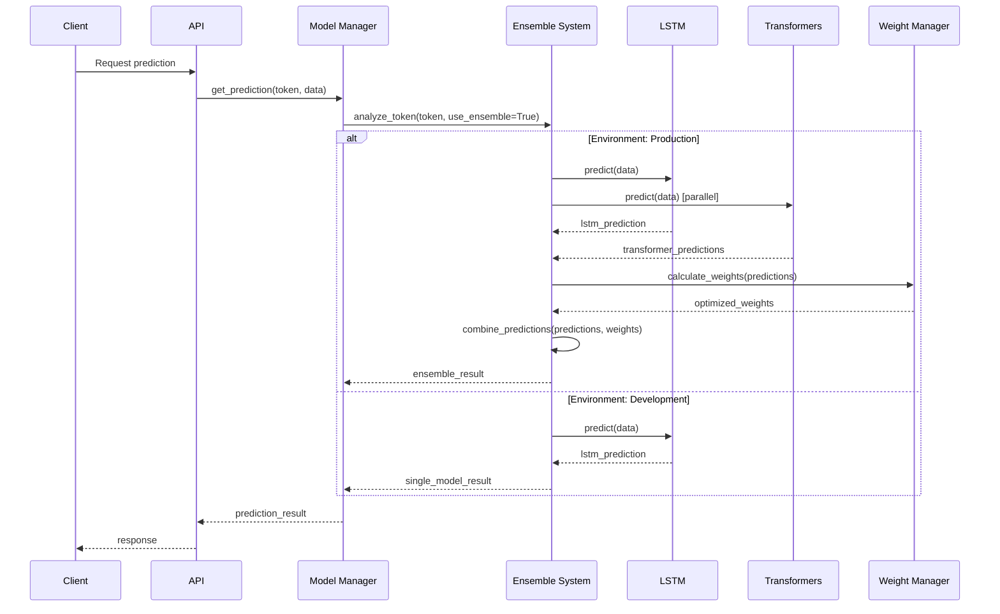
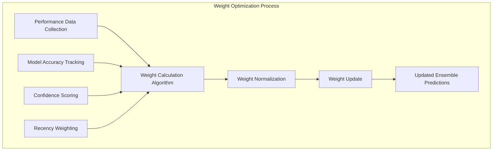
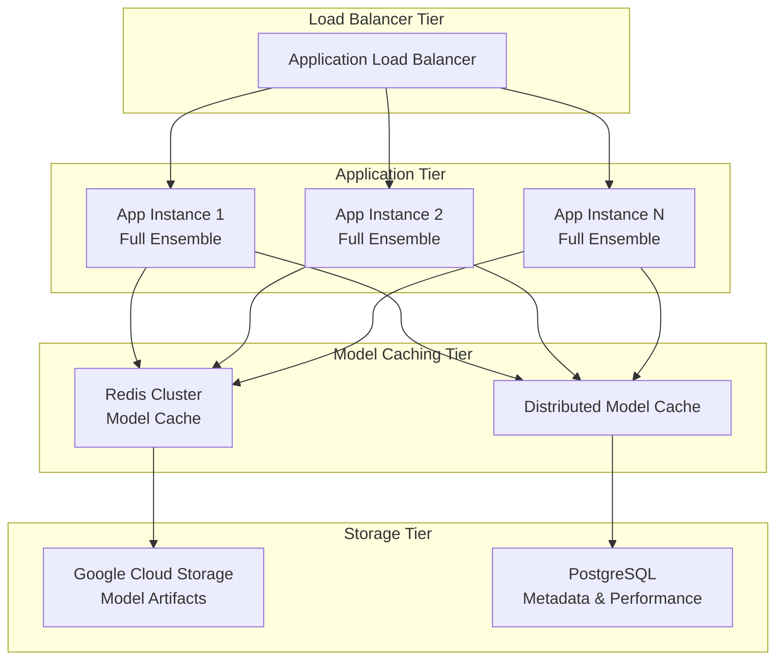
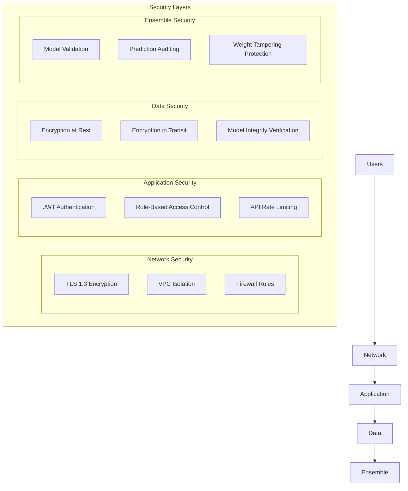

# Shyvr AI RLTE - System Architecture Documentation

## Table of Contents
- [System Overview](#system-overview)
- [Ensemble ML Architecture](#ensemble-ml-architecture)
- [Environment-Based Deployment](#environment-based-deployment)
- [Component Architecture](#component-architecture)
- [Data Flow Architecture](#data-flow-architecture)
- [Integration Points](#integration-points)
- [Scalability and Performance](#scalability-and-performance)
- [Security Architecture](#security-architecture)

## System Overview

The Shyvr AI RLTE (Reinforcement Learning Trading Engine) is built around an **ensemble-only architecture** that combines LSTM models with four specialized transformer models for superior prediction accuracy and risk management. The system uses environment-based configuration to optimize resource allocation and model deployment strategies.



### Key Architectural Principles

1. **Ensemble-First Design**: All components designed to work with multiple models simultaneously
2. **Environment-Based Configuration**: Resource allocation and model selection based on deployment environment
3. **Dynamic Weight Management**: Intelligent model weight adjustment based on performance and confidence
4. **Graceful Degradation**: Automatic fallback to available models if others fail
5. **Resource Optimization**: Environment-specific resource allocation for cost efficiency

## Ensemble ML Architecture

### Core Ensemble Components

The ML system is built around a unified ensemble approach that eliminates single-model deployment complexity:



### Model Specializations

Each model in the ensemble serves a specific purpose:

| Model | Specialization | Contribution |
|-------|----------------|--------------|
| **LSTM** | Base sequential modeling | Reliable baseline predictions |
| **iTransformer** | Inverted attention mechanism | Enhanced temporal pattern recognition |
| **PatchTST** | Patch-based processing | Local pattern analysis |
| **TimesMixer** | Multi-scale time mixing | Cross-temporal feature fusion |
| **TimesFM** | Foundation model capabilities | Transfer learning and generalization |

### Dynamic Weight Management

The ensemble uses sophisticated weight management to optimize prediction quality:

```python
# Example ensemble weight calculation
class EnsembleWeightManager:
    def calculate_weights(self, environment: str) -> Dict[ModelType, float]:
        if environment == "development":
            # LSTM only in development
            return {ModelType.LSTM: 1.0}
        elif environment == "production":
            # Full ensemble with performance-based weights
            return self._calculate_performance_weights()
        else:
            # Default to production weights
            return self._get_default_weights()
```

## Environment-Based Deployment

The system uses the `ENVIRONMENT` variable to determine deployment configuration, replacing the previous single-model `TRANSFORMER_MODEL_TYPE` approach:

### Environment Configurations



### Resource Allocation by Environment

| Environment | Models | Memory | CPU | Timeout | Use Case |
|-------------|--------|--------|-----|---------|----------|
| **Development** | LSTM only | 2Gi | 1 CPU | 1800s | Local testing, debugging |
| **Staging** | Full ensemble | 4Gi | 3 CPU | 3600s | Integration testing |
| **Production** | Full ensemble | 8Gi | 6 CPU | 4200s | Live trading |

### Configuration Loading Process

```bash
# Simplified deployment commands using ENVIRONMENT
ENVIRONMENT=development ./deploy/deploy.sh staging standard
ENVIRONMENT=production ./deploy/deploy.sh production standard
ENVIRONMENT=staging ./deploy/deploy.sh staging standard

# Default behavior (production if not specified)
./deploy/deploy.sh production standard
```

## Component Architecture

### High-Level System Components



### Core Component Interactions

#### Model Manager Integration

```python
class ModelManager:
    def __init__(self, config: Dict[str, Any]):
        self.environment = os.getenv('ENVIRONMENT', 'production')
        self._initialize_models_for_environment()
    
    def _initialize_models_for_environment(self):
        if self.environment == 'development':
            # Initialize LSTM only
            self.models = {ModelType.LSTM: LSTMModel()}
        else:
            # Initialize full ensemble
            self.models = {
                ModelType.LSTM: LSTMModel(),
                ModelType.ITRANSFORMER: iTransformer(),
                ModelType.PATCHTST: PatchTST(),
                ModelType.TIMESMIXER: TimesMixer(),
                ModelType.TIMESFM: TimesFM()
            }
```

#### Safety System Integration

The safety system works seamlessly with the ensemble approach:

```python
class TradingSafetyManager:
    def validate_ensemble_decision(self, predictions: Dict[ModelType, PredictionResult]) -> bool:
        # Multi-model consensus checking
        consensus_threshold = 0.7
        return self._check_model_consensus(predictions, consensus_threshold)
    
    def _check_model_consensus(self, predictions: Dict, threshold: float) -> bool:
        # Ensure ensemble predictions are consistent
        directions = [pred.direction for pred in predictions.values()]
        consensus_ratio = self._calculate_consensus(directions)
        return consensus_ratio >= threshold
```

## Data Flow Architecture

### Ensemble Prediction Flow



### Model Weight Optimization Flow



## Integration Points

### Mode Manager Integration

The Mode Manager seamlessly works with the ensemble system across all trading modes:

```python
class ModeManager:
    def initialize_mode(self, mode_type: str):
        # All modes use ensemble predictions
        self.prediction_source = self.model_manager.get_ensemble_predictor()
        
    def get_trading_signal(self, symbol: str) -> TradingSignal:
        # Use ensemble for all modes
        prediction = self.prediction_source.predict(symbol)
        return self._convert_to_signal(prediction)
```

### Safety System Integration

```python
class SafetyManager:
    def validate_trading_decision(self, decision: TradingDecision) -> ValidationResult:
        # Enhanced validation using ensemble confidence
        ensemble_confidence = decision.prediction.ensemble_confidence
        model_agreement = decision.prediction.model_agreement
        
        if ensemble_confidence < self.min_confidence_threshold:
            return ValidationResult(valid=False, reason="Low ensemble confidence")
        
        if model_agreement < self.min_agreement_threshold:
            return ValidationResult(valid=False, reason="Poor model agreement")
        
        return ValidationResult(valid=True)
```

### RL Agent Integration

```python
class DQNAgent:
    def get_action(self, state: np.ndarray) -> int:
        # RL agent uses ensemble predictions as part of state
        ensemble_prediction = self.model_manager.get_ensemble_prediction(state)
        enhanced_state = np.concatenate([state, ensemble_prediction.as_vector()])
        return super().get_action(enhanced_state)
```

## Scalability and Performance

### Horizontal Scaling Architecture



### Performance Optimization Strategies

| Component | Optimization Strategy | Expected Performance |
|-----------|----------------------|---------------------|
| **Model Loading** | Lazy loading with environment-based selection | 60s → 30s initialization |
| **Prediction** | Parallel ensemble inference | <100ms response time |
| **Caching** | Multi-level cache hierarchy | 95% cache hit rate |
| **Weight Updates** | Asynchronous weight calculation | <5ms overhead |
| **Memory** | Environment-based allocation | 2-8Gi based on environment |

### Resource Utilization Monitoring

```python
class ResourceMonitor:
    def track_ensemble_performance(self):
        metrics = {
            'memory_usage_per_model': self._get_model_memory_usage(),
            'prediction_latency_by_model': self._get_latency_metrics(),
            'ensemble_cache_performance': self._get_cache_stats(),
            'weight_calculation_overhead': self._get_weight_overhead()
        }
        return metrics
```

## Security Architecture

### Multi-Layer Security Model



### Ensemble-Specific Security Measures

1. **Model Integrity**: Checksum validation for all ensemble models
2. **Prediction Auditing**: Full audit trail of ensemble decisions
3. **Weight Protection**: Encrypted storage of model weights
4. **Consensus Validation**: Multi-model agreement verification

## Deployment Architecture

### Environment-Based Deployment Strategy

```bash
# Deployment commands for different environments

# Development deployment (LSTM only, minimal resources)
ENVIRONMENT=development ./deploy/deploy.sh staging standard

# Staging deployment (full ensemble, moderate resources)  
ENVIRONMENT=staging ./deploy/deploy.sh staging standard

# Production deployment (full ensemble, full resources)
ENVIRONMENT=production ./deploy/deploy.sh production standard

# Default deployment (defaults to production)
./deploy/deploy.sh production standard
```

### Configuration Management

```yaml
# deploy/configs/environments.json
{
  "development": {
    "models": ["lstm"],
    "resources": {
      "memory": "2Gi",
      "cpu": "1",
      "timeout": "1800s"
    },
    "purpose": "Local testing and debugging"
  },
  "production": {
    "models": ["lstm", "iTransformer", "PatchTST", "TimesMixer", "TimesFM"],
    "resources": {
      "memory": "8Gi", 
      "cpu": "6",
      "timeout": "4200s"
    },
    "purpose": "Live trading with full ensemble"
  }
}
```

## Summary

The Shyvr AI RLTE system architecture is built around these core principles:

1. **Ensemble-Only Architecture**: All components designed for multi-model operation
2. **Environment-Based Configuration**: Intelligent resource allocation based on deployment context
3. **Dynamic Adaptation**: Real-time weight optimization and model selection
4. **Graceful Degradation**: Robust fallback mechanisms for high availability
5. **Resource Efficiency**: Environment-specific resource allocation for cost optimization

This architecture eliminates the complexity of single-model deployments while providing maximum flexibility and performance for different operational contexts.

---

**Document Version**: 1.0  
**Last Updated**: August 6, 2025  
**Architecture Status**: Ensemble-Only Production Ready