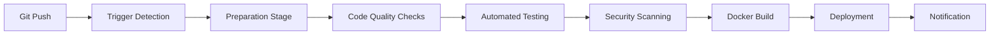

# CI/CD Pipeline Guide for Shyvr RLTE Trading System

## Overview

This document provides comprehensive guidance for the Shyvr RLTE CI/CD pipeline built with Google Cloud Build. The pipeline provides automated testing, building, security scanning, and deployment for the AI-augmented cryptocurrency trading system.

## Pipeline Architecture

### Multi-Stage Pipeline Design



### Branch-Specific Workflows

| Branch | Environment | Deployment Target | Testing Level |
|--------|-------------|-------------------|---------------|
| `main` | Production | `shyvr-rlte` | Full suite + E2E |
| `develop` | Staging | `shyvr-rlte-staging` | Full suite |
| `feature/*` | Testing | None | Unit + Integration |
| PRs to `main` | Testing | None | Unit + Integration |

## Pipeline Stages

### 1. Preparation Stage
- **Duration**: ~30 seconds
- **Purpose**: Set up build environment and restore caches
- **Key Steps**:
  - Git configuration and workspace setup
  - Cache restoration from Cloud Storage
  - Environment variable setup

### 2. Code Quality & Security
- **Duration**: ~2-3 minutes
- **Purpose**: Ensure code quality and security standards
- **Tools**:
  - **Black**: Code formatting validation
  - **isort**: Import sorting validation
  - **Ruff**: Fast Python linting
  - **MyPy**: Static type checking
  - **Trivy**: Security vulnerability scanning

### 3. Automated Testing
- **Duration**: ~5-8 minutes
- **Purpose**: Comprehensive test execution
- **Test Categories**:
  - **Unit Tests**: Fast, isolated component tests
  - **Integration Tests**: Cross-module functionality
  - **Performance Tests**: Benchmark validation

### 4. Docker Build & Security
- **Duration**: ~3-5 minutes
- **Purpose**: Create optimized, secure container images
- **Features**:
  - Multi-stage Docker builds
  - Layer caching for faster builds
  - Security scanning of built images
  - Image tagging with commit SHA

### 5. Deployment
- **Duration**: ~2-4 minutes
- **Purpose**: Deploy to appropriate environment
- **Configuration**:
  - Branch-specific deployment logic
  - Secret Manager integration
  - Cloud SQL connectivity
  - Health check validation

## Setup Instructions

### Prerequisites

1. **Google Cloud Project Setup**:
   ```bash
   export PROJECT_ID="shvyr-ai-bots"
   gcloud config set project $PROJECT_ID
   gcloud auth login
   ```

2. **Enable Required APIs**:
   ```bash
   gcloud services enable cloudbuild.googleapis.com
   gcloud services enable artifactregistry.googleapis.com
   gcloud services enable run.googleapis.com
   gcloud services enable secretmanager.googleapis.com
   ```

### Infrastructure Setup

1. **Run Infrastructure Setup**:
   ```bash
   # Set up Cloud SQL database
   ./deploy/setup_cloud_sql.sh
   
   # Configure secrets
   ./deploy/setup_secrets.sh
   
   # Set up build triggers (requires GitHub connection)
   export REPO_OWNER="your-github-username"
   ./deploy/setup_build_triggers.sh
   ```

2. **Connect GitHub Repository**:
   - Go to [Cloud Build Triggers](https://console.cloud.google.com/cloud-build/triggers)
   - Click "Connect Repository"
   - Select GitHub and authenticate
   - Choose your repository

### Manual Trigger Setup

If you prefer manual trigger creation:

```bash
# Create main branch trigger (production)
gcloud builds triggers create github \
  --repo-name="shyvrai-rlte" \
  --repo-owner="your-username" \
  --branch-pattern="^main$" \
  --build-config="cloudbuild.yaml" \
  --name="shyvr-rlte-main-trigger"

# Create develop branch trigger (staging)
gcloud builds triggers create github \
  --repo-name="shyvrai-rlte" \
  --repo-owner="your-username" \
  --branch-pattern="^develop$" \
  --build-config="cloudbuild.yaml" \
  --name="shyvr-rlte-develop-trigger"
```

## Configuration Management

### Environment Variables

The pipeline uses branch-specific environment variables:

```yaml
# Production (main branch)
ENVIRONMENT: production
LOG_LEVEL: INFO
TRADING_MODE: simulation  # Can be changed to 'live' for real trading

# Staging (develop branch)
ENVIRONMENT: staging
LOG_LEVEL: INFO
TRADING_MODE: simulation

# Testing (feature branches)
ENVIRONMENT: test
LOG_LEVEL: DEBUG
```

### Secret Manager Integration

Required secrets for full functionality:

#### Core System Secrets (Required)
- `TELEGRAM_TOKEN`: Telegram bot token
- `WEBHOOK_SECRET`: Webhook security secret
- `DB_PASSWORD`: Database user password
- `DATABASE_URL`: Full database connection string

#### API Secrets (Optional but Recommended)
- `HELIUS_API_KEY`: Solana RPC provider
- `BIRDEYE_API_KEY`: DeFi data aggregator
- `XAI_API_KEY`: xAI/Grok API for analysis
- `OPENAI_API_KEY`: OpenAI GPT API
- `COINGECKO_API_KEY`: Market data API
- `LUNARCRUSH_API_KEY`: Social sentiment data

#### Trading Secrets (Production Only)
- `SOLANA_PRIVATE_KEY`: Solana wallet private key
- `ETHEREUM_PRIVATE_KEY`: Ethereum wallet private key
- `HYPERLIQUID_PRIVATE_KEY`: Exchange private key

### Creating Secrets

```bash
# Create a secret
echo "your-secret-value" | gcloud secrets create SECRET_NAME --data-file=-

# Update a secret
echo "new-secret-value" | gcloud secrets versions add SECRET_NAME --data-file=-

# Verify secret
gcloud secrets versions access latest --secret="SECRET_NAME"
```

## Pipeline Optimization

### Build Caching

The pipeline uses multiple caching strategies:

1. **Dependency Caching**: UV and pip caches stored in Cloud Storage
2. **Docker Layer Caching**: Previous image layers reused
3. **Artifact Caching**: Build artifacts stored for analysis

### Performance Optimizations

```yaml
# Machine configuration for ML workloads
options:
  machineType: 'E2_HIGHCPU_8'  # 8 vCPUs, optimized for CPU-intensive tasks
  diskSizeGb: 100               # Sufficient for ML dependencies
  logging: CLOUD_LOGGING_ONLY   # Faster logging
```

### Build Time Breakdown

Expected build times by stage:

| Stage | Duration | Optimization |
|-------|----------|--------------|
| Preparation | 30s | Cache restoration |
| Dependencies | 2-3min | UV for fast installs |
| Code Quality | 1-2min | Parallel checks |
| Testing | 5-8min | Parallel test execution |
| Docker Build | 3-5min | Multi-stage + caching |
| Deployment | 2-4min | Conditional by branch |
| **Total** | **13-22min** | Optimized for ML workloads |

## Monitoring & Troubleshooting

### Build Monitoring

1. **Cloud Build Console**: [https://console.cloud.google.com/cloud-build/builds](https://console.cloud.google.com/cloud-build/builds)
2. **Build Logs**: Available in real-time during builds
3. **Build History**: Full history with filtering options

### Common Issues & Solutions

#### 1. Test Failures
```bash
# Locally run the same tests as pipeline
uv run pytest tests/unit/ --cov=src --tb=short -v
uv run pytest tests/integration/ --tb=short -v
```

#### 2. Security Scan Failures
```bash
# Run local security scan
trivy fs --security-checks vuln,secret,config .
trivy image your-image-name
```

#### 3. Dependency Issues
```bash
# Update dependencies
uv sync --upgrade
uv lock

# Clear local cache
rm -rf .cache/uv
rm -rf .cache/pip
```

#### 4. Docker Build Issues
```bash
# Test Docker build locally
docker build --platform linux/amd64 -t test-image .
docker run --rm test-image python -c "import src; print('OK')"
```

### Pipeline Debugging

#### Enable Verbose Logging
```yaml
# Add to cloudbuild.yaml step
env:
- 'DEBUG=1'
- 'VERBOSE=1'
```

#### Access Build Artifacts
```bash
# Download build artifacts
gsutil cp -r gs://$PROJECT_ID-build-artifacts/$BUILD_ID/ ./build-artifacts/

# View coverage report
open build-artifacts/coverage.xml
```

#### Debug Failed Deployments
```bash
# Check Cloud Run logs
gcloud run logs tail shyvr-rlte --region=us-central1

# Check service status
gcloud run services describe shyvr-rlte --region=us-central1
```

## Security Best Practices

### Secret Management
- Never commit secrets to repository
- Use Secret Manager for all sensitive data
- Rotate secrets regularly
- Use least-privilege access

### Image Security
- Multi-stage builds to minimize attack surface
- Regular security scanning with Trivy
- Non-root user in production containers
- Minimal base images

### Access Control
- Branch protection rules in GitHub
- IAM roles with minimal permissions
- Audit logs enabled
- Secure webhook endpoints

## Advanced Usage

### Custom Build Triggers

Create custom triggers for specific use cases:

```bash
# Create manual trigger for hotfixes
gcloud builds triggers create github \
  --repo-name="shyvrai-rlte" \
  --repo-owner="your-username" \
  --tag-pattern="hotfix-*" \
  --build-config="cloudbuild-hotfix.yaml" \
  --name="shyvr-rlte-hotfix-trigger"
```

### Pipeline Extensions

#### Adding New Test Categories
1. Create new test step in `cloudbuild.yaml`
2. Add test marker in `pyproject.toml`
3. Create test files with appropriate markers

#### Custom Deployment Targets
1. Add new deployment step with branch conditions
2. Configure Cloud Run service
3. Set up monitoring and alerting

### Performance Monitoring

#### Build Metrics
- Track build duration trends
- Monitor success/failure rates
- Analyze bottlenecks

#### Application Metrics
- Deployment success rates
- Health check response times
- Resource utilization

## Support & Maintenance

### Regular Maintenance Tasks

1. **Weekly**:
   - Review build performance metrics
   - Check for dependency updates
   - Monitor security scan results

2. **Monthly**:
   - Rotate sensitive secrets
   - Review and update documentation
   - Analyze cost optimization opportunities

3. **Quarterly**:
   - Update base images and dependencies
   - Review and optimize pipeline configuration
   - Security audit of entire pipeline

### Getting Help

1. **Build Issues**: Check Cloud Build logs and error messages
2. **Deployment Issues**: Review Cloud Run logs and service status
3. **Security Issues**: Review Trivy scan results and fix vulnerabilities
4. **Performance Issues**: Analyze build metrics and optimize bottlenecks

### Contributing

When modifying the pipeline:

1. Test changes in feature branches first
2. Update documentation for configuration changes
3. Add tests for new pipeline components
4. Follow security best practices

---

## Quick Reference

### Essential Commands

```bash
# Manual build trigger
gcloud builds submit --config=cloudbuild.yaml

# View build logs
gcloud builds log $BUILD_ID

# Check service status
gcloud run services list --region=us-central1

# Update secrets
echo "new-value" | gcloud secrets versions add SECRET_NAME --data-file=-

# View pipeline configuration
gcloud builds triggers list
```

### Important URLs

- [Cloud Build Console](https://console.cloud.google.com/cloud-build)
- [Cloud Run Services](https://console.cloud.google.com/run)
- [Secret Manager](https://console.cloud.google.com/security/secret-manager)
- [Artifact Registry](https://console.cloud.google.com/artifacts)

This comprehensive CI/CD pipeline ensures reliable, secure, and efficient deployment of the Shyvr RLTE trading system across all environments.