# Model Preservation System - Architecture Documentation

## Table of Contents
- [System Overview](#system-overview)
- [Component Architecture](#component-architecture)
- [Data Flow](#data-flow)
- [Database Schema](#database-schema)
- [Cache Hierarchy](#cache-hierarchy)
- [Integration Points](#integration-points)
- [Security Architecture](#security-architecture)
- [Scalability Considerations](#scalability-considerations)

## System Overview

The Model Preservation System is a comprehensive solution for managing machine learning model lifecycles in the Shyvr RLTE system. It provides versioning, storage, caching, and monitoring capabilities across multiple environments.

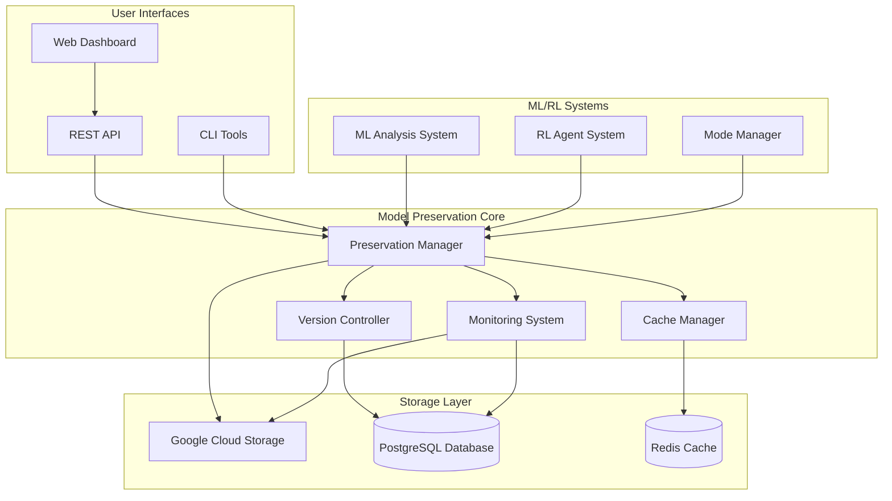

### Key Components

- **Preservation Manager**: Central orchestrator for all model operations
- **Version Controller**: Handles semantic versioning and branching
- **Cache Manager**: Multi-level caching for performance optimization
- **Storage Handlers**: Abstracted storage operations for GCS and database
- **Monitoring System**: Performance tracking and health monitoring
- **API Layer**: RESTful interface for external integrations

## Component Architecture

### Core Components Interaction

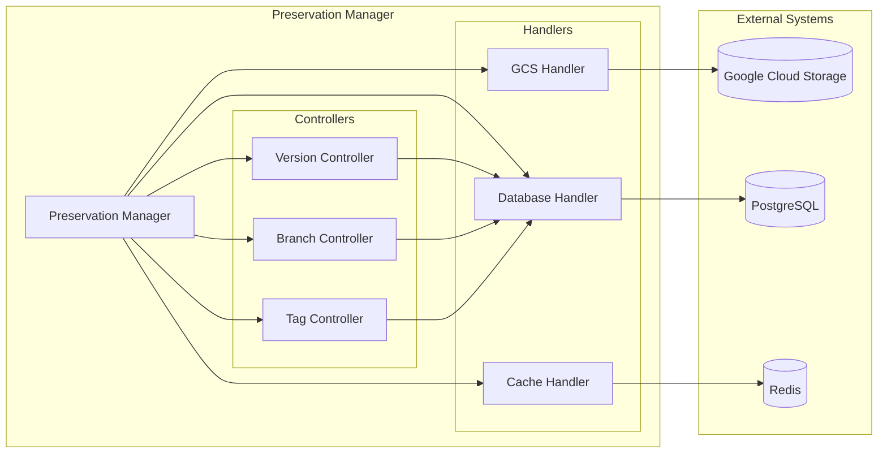

### Class Hierarchy

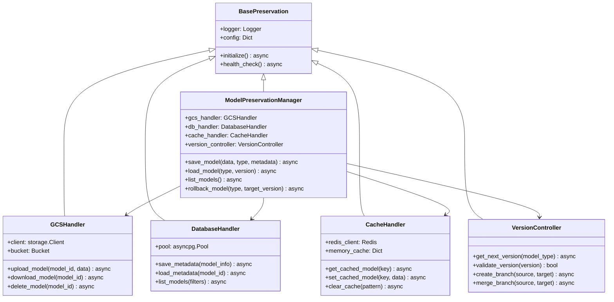

## Data Flow

### Model Save Flow

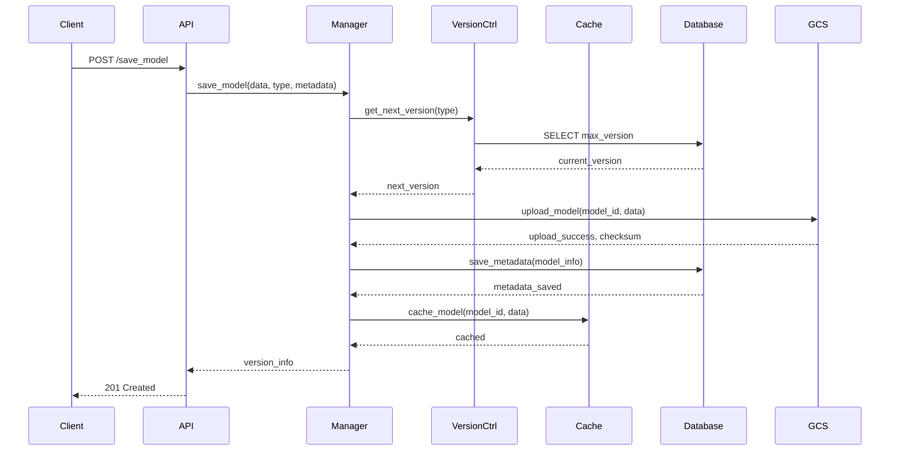

### Model Load Flow

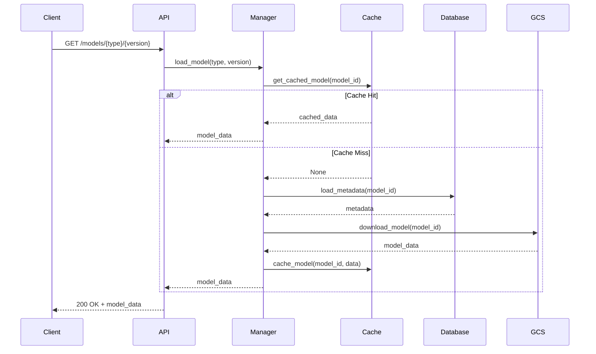

### Rollback Flow

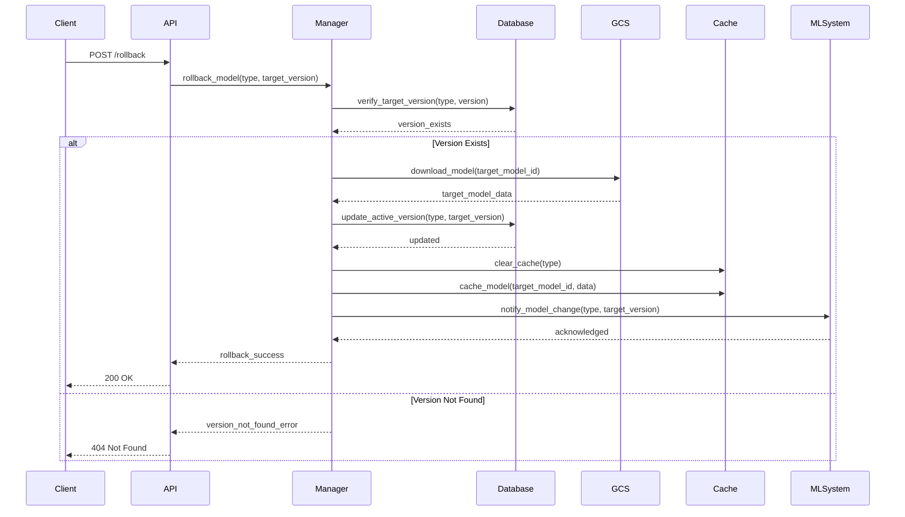

## Database Schema

### Core Tables Structure

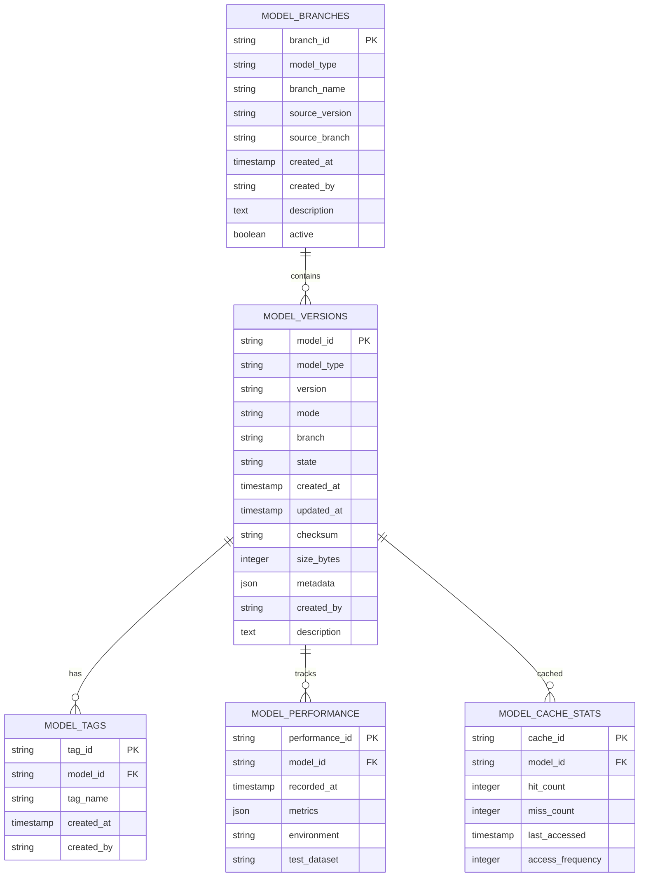

### Schema Details

```sql
-- Model versions table
CREATE TABLE model_versions (
    model_id VARCHAR(255) PRIMARY KEY,
    model_type VARCHAR(100) NOT NULL,
    version VARCHAR(50) NOT NULL,
    mode VARCHAR(50) DEFAULT 'default',
    branch VARCHAR(100) DEFAULT 'main',
    state VARCHAR(50) DEFAULT 'active',
    created_at TIMESTAMP WITH TIME ZONE DEFAULT NOW(),
    updated_at TIMESTAMP WITH TIME ZONE DEFAULT NOW(),
    checksum VARCHAR(64),
    size_bytes BIGINT,
    metadata JSONB DEFAULT '{}',
    created_by VARCHAR(100),
    description TEXT,
    
    UNIQUE(model_type, version, mode, branch)
);

-- Indexes for efficient queries
CREATE INDEX idx_model_versions_type_version ON model_versions(model_type, version);
CREATE INDEX idx_model_versions_created_at ON model_versions(created_at DESC);
CREATE INDEX idx_model_versions_branch ON model_versions(branch);
CREATE INDEX idx_model_versions_state ON model_versions(state);
CREATE INDEX idx_model_versions_metadata ON model_versions USING GIN(metadata);
```

## Cache Hierarchy

The system implements a multi-level caching strategy for optimal performance:

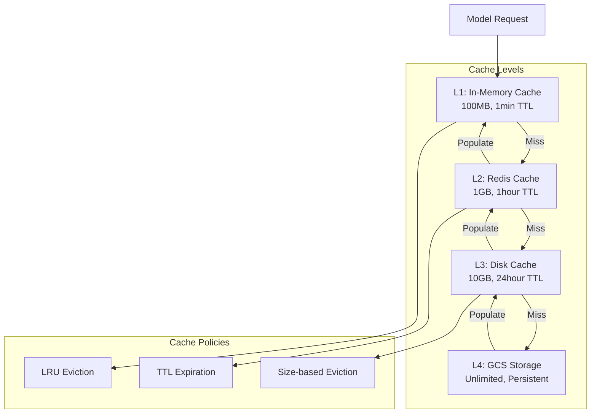

### Cache Implementation Details

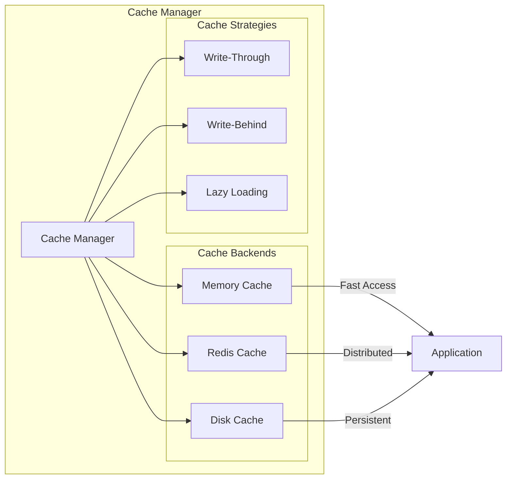

## Integration Points

### ML/RL System Integration

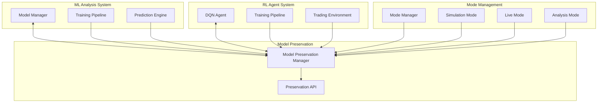

### External System Interfaces

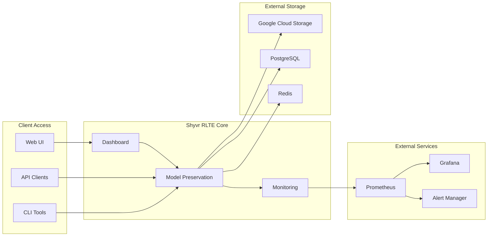

## Security Architecture

### Authentication and Authorization Flow

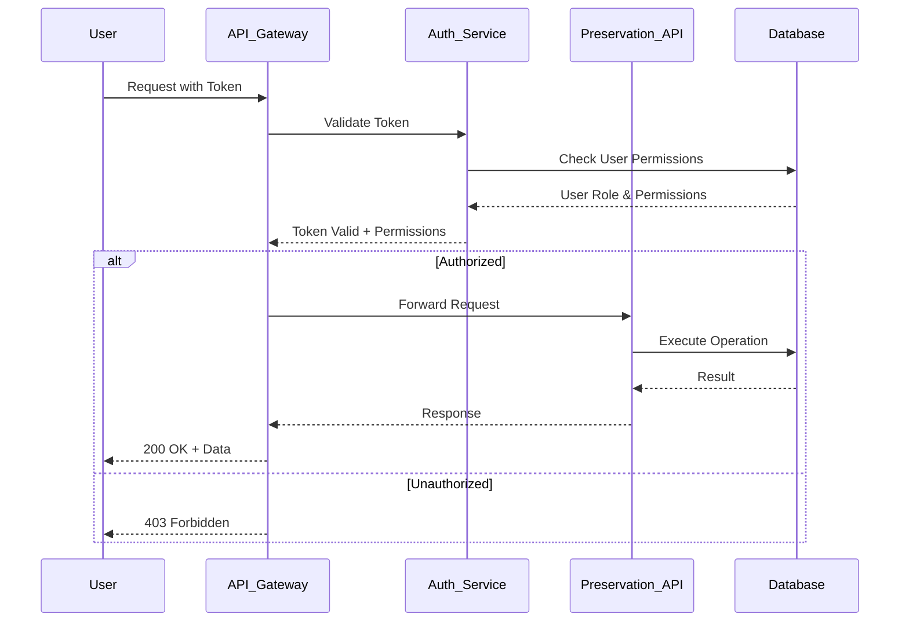

### Security Layers

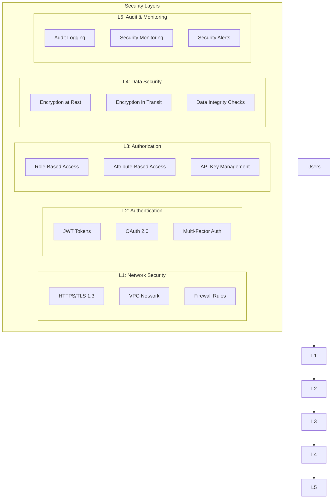

## Scalability Considerations

### Horizontal Scaling Architecture

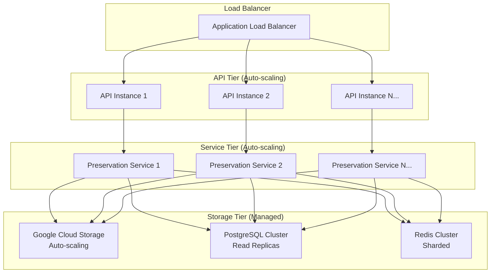

### Performance Optimization Patterns

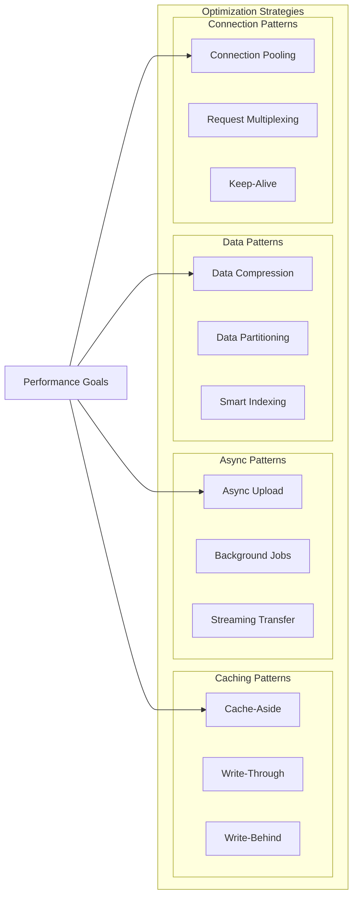

### Monitoring and Observability

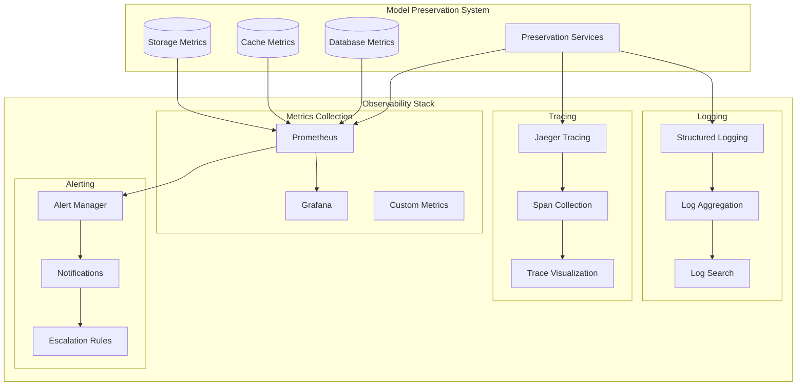

This architecture documentation provides a comprehensive view of the Model Preservation System's design, from high-level system architecture to detailed component interactions, data flows, and scalability considerations. The mermaid diagrams offer visual representations that make the complex system easier to understand and maintain.