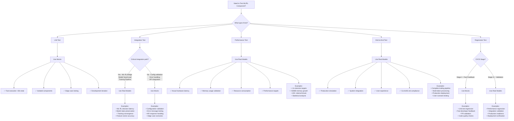

# Testing Decision Tree - Quick Reference

*Quick decision guide for choosing between mock and real model testing approaches*

## Decision Flowchart



## Quick Decision Matrix

| Test Scenario | Mock | Real | Rationale |
|---------------|------|------|-----------|
| **Unit Tests** | ✅ | ❌ | Speed & isolation crucial |
| **Config Validation** | ✅ | ❌ | Fast feedback, no ML needed |
| **Error Handling** | ✅ | ❌ | Edge cases, controlled failures |
| **API Integration** | ✅ | ❌ | External dependencies |
| **ML-RL Bridge** | ❌ | ✅ | Critical integration path |
| **Model Save/Load** | ❌ | ✅ | State preservation critical |
| **Training Pipeline** | ❌ | ✅ | Convergence validation |
| **Performance Targets** | ❌ | ✅ | Real hardware constraints |
| **Memory Testing** | ❌ | ✅ | Actual resource usage |
| **Latency Benchmarks** | ❌ | ✅ | Production timing |
| **End-to-End Flow** | ❌ | ✅ | Complete system validation |
| **CI Fast Feedback** | ✅ | ❌ | Developer productivity |
| **CI Final Validation** | ❌ | ✅ | Production confidence |
| **Regression Detection** | ✅ | ✅ | Two-stage approach |

## Time Investment Guidelines

### Mock Tests (Fast Feedback)
- **Target**: <30 seconds total execution
- **Frequency**: Every commit, every PR
- **Coverage**: 80%+ of unit tests
- **Focus**: Logic, edge cases, configuration

### Real Model Tests (Validation)
- **Target**: <10 minutes execution
- **Frequency**: Pre-merge, nightly builds
- **Coverage**: Critical paths, performance
- **Focus**: Integration, performance, production readiness

## Performance Target Quick Reference

From CLAUDE.md requirements:

| Metric | Target | Test Type | Implementation |
|--------|--------|-----------|----------------|
| ML Prediction | <1s | Real Models | PyTorch LSTM |
| RL Decision | <1s | Real Models | PyTorch DQN |
| ML-RL Integration | <1s | Real Models | End-to-end |
| Batch Processing | 100+ tokens/min | Real Models | Throughput test |
| Memory Growth | <50MB | Real Models | Memory tracking |

## Test Architecture Patterns

### 1. Mock-First Unit Testing
```python
@pytest.mark.unit
@pytest.mark.mock_only
def test_dqn_agent_configuration():
    """Fast unit test with mock"""
    mock_config = create_mock_config()
    agent = DQNTradingAgent(mock_config)
    assert agent.epsilon == mock_config.epsilon_start
```

### 2. Real Model Integration
```python
@pytest.mark.integration  
@pytest.mark.real_models
def test_dqn_agent_actual_performance():
    """Integration test with real PyTorch model"""
    agent = DQNTradingAgent(config, use_enhanced_features=True)
    latency = measure_prediction_latency(agent)
    assert latency < 1.0, f"Latency {latency:.3f}s exceeds target"
```

### 3. Hybrid Benchmarking
```python
@pytest.mark.performance
def test_real_vs_mock_comparison():
    """Compare real vs mock for optimization insights"""
    real_metrics = benchmark_real_agent()
    mock_metrics = benchmark_mock_agent()
    
    ratio = real_metrics.mean / mock_metrics.mean
    assert ratio < 100, f"Real agent {ratio:.1f}x slower than mock"
```

## Common Patterns by Test Type

### Development Phase
- **Primary**: Mock-based unit tests
- **Secondary**: Selected integration tests
- **Focus**: Fast iteration, immediate feedback

### Pre-Merge Validation
- **Primary**: Real model integration tests
- **Secondary**: Performance spot checks
- **Focus**: Production readiness verification

### CI/CD Pipeline
- **Stage 1**: All mock tests (fast feedback)
- **Stage 2**: Real model integration
- **Stage 3**: Performance benchmarks
- **Stage 4**: End-to-end validation

### Production Monitoring
- **Continuous**: Performance metrics collection
- **Daily**: Regression detection
- **Weekly**: Comprehensive benchmark comparison

## Red Flags - When to Switch Approaches

### Switch from Mock to Real if:
- ❌ Mock behavior diverges from real implementation
- ❌ Performance assumptions prove incorrect
- ❌ Integration issues emerge late in cycle
- ❌ Production bugs not caught by mock tests

### Switch from Real to Mock if:
- ❌ Tests take too long for development workflow
- ❌ Hardware dependencies create CI bottlenecks
- ❌ Test flakiness due to resource contention
- ❌ Developer productivity suffers

## Success Metrics

### Mock Testing Success
- Unit tests complete in <30 seconds
- 95%+ test reliability
- Fast developer feedback cycle
- High code coverage (80%+)

### Real Model Testing Success
- Performance targets consistently met
- No production surprises
- Integration issues caught early
- Statistical confidence in results

### Hybrid Strategy Success
- **435+ total tests passing** ✅
- **90% overall coverage** ✅
- **Sub-second production performance** ✅
- **10-4000x target exceedance** ✅